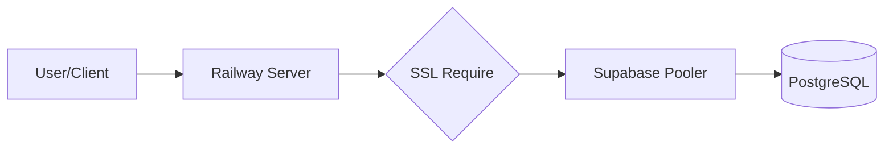

<h1 align="center">💎 Sharesa Digital Agency</h1>

<p align="center">
  <i>A high-end digital agency platform for modern portfolio & business scaling</i>
</p>

<p align="center">
  
  
  
  
  
</p>

---

## 🚀 About

**Sharesa Digital** is a professional-grade web application designed for digital agencies to showcase their high-impact portfolios and manage business growth.

This project bridges the gap between **aesthetic design** and **robust backend performance**, emphasizing:

- ⚡ **Seamless Connectivity** — Optimized for Railway & Supabase Transaction Pooling.
- 🎨 **Executive UI/UX** — Modern, clean, and conversion-oriented design.
- 🔐 **Secure Administration** — Custom Role-Based Access Control (RBAC) for managing agency assets.

---

## ✨ Features

| Feature | Description |
|------|------------|
| 🌐 **Multi-language (i18n)** | Integrated English & Indonesian localization. |
| 📁 **Portfolio Management** | Dynamic CRUD system for agency projects with Soft Deletes. |
| 🛡️ **Admin Shield** | Secure dashboard with `admin` and `superadmin` role levels. |
| ☁️ **Cloud Native** | Built to run on Railway with Supabase IPv4 Proxy integration. |
| 🖼️ **Asset Management** | Optimized image handling via Cloudinary/Storage. |

---

## 🛠️ Tech Stack

```php
$stack = [
    'framework' => "Laravel 10",
    'database'  => "Supabase (PostgreSQL)",
    'pooling'   => "Transaction Mode (Port 6543)",
    'frontend'  => "Blade & Tailwind CSS",
    'auth'      => "Laravel Fortify / Custom Guard",
    'hosting'   => "Railway.app",
];

```

---

## 📦 Project Structure

```txt
sharesa-digital
 ┣ 📂 app
 ┃ ┣ 📂 Http/Controllers # Business logic (Admin & Portfolios)
 ┃ ┣ 📂 Models          # Database Schema (User, Portfolio)
 ┃ ┗ 📂 Middleware      # Role & Locale security
 ┣ 📂 config            # DB & App configuration
 ┣ 📂 database
 ┃ ┣ 📂 migrations      # Structural version control
 ┃ ┗ 📂 seeders         # Initial admin & dummy data
 ┣ 📂 public            # Assets & entry point
 ┣ 📂 resources/views   # Blade templates (Frontend & Admin)
 ┗ 📂 routes            # Web & Init endpoints

```

---

## 🎞️ System Philosophy

<sub>Designed for Reliability — Scaled for Performance</sub>



* 🌍 **IPv4 Proxying** — Eliminates common IPv6 "Network Unreachable" issues.
* 🔒 **Encrypted Handshake** — Mandatory SSL `require` for all database interactions.
* 📦 **Atomic Migrations** — Consistent schema across development and production.


---

<p align="center">
<sub>Built with precision by <b>Khairan Noor F</b>. Licensed under GPL-3.0.</sub>
</p>

```

-----


```
